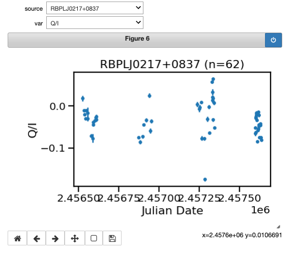

# RoboPol Data Release Helper
Tools to help with the RoboPol Data Release (currently a Jupyter Notebook)

The Jupyter notebook reads the two datafiles and plots a few parameters.
Through a few interactive plots it shows how to display time series
for all 222 AGN. The notebook as displayed inside GitHub may not show
the interactvity, and will have to be downloaded and run locally for best
effect.

- [README.txt](README.txt) Column descriptions
- [sample.csv](sample.csv) The sample of 222 AGNs
- [monitoring_data.csv](monitoring_data.csv) Time series for the 222 AGN

